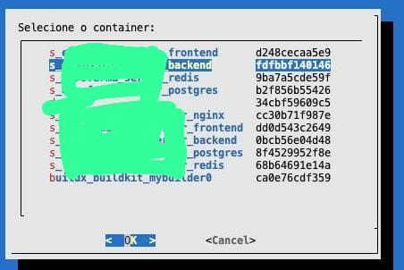
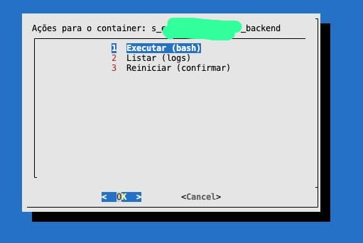
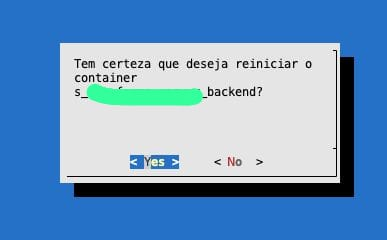

Aqui está o **README.md** completo, utilizando nomes fictícios para os containers e aproveitando as descrições das imagens fornecidas.

---

### **README.md**
```markdown
# Docker PS Call

O **Docker PS Call** é um script em Bash interativo que facilita o gerenciamento de containers Docker. Através de uma interface simples baseada no **dialog**, o usuário pode listar containers em execução e executar ações como:

1. **Abrir um bash** no container.
2. **Visualizar logs** em tempo real.
3. **Reiniciar** um container com confirmação.

---

## **Funcionalidades**

### **Menu Principal**
O script lista todos os containers Docker em execução e permite selecionar um deles através de um menu.



**Detalhes**:
- **Nome do Container**: Identificador legível do container.
- **ID Parcial**: Os primeiros caracteres do ID do container.

---

### **Ações Disponíveis**

Ao selecionar um container, um **sub-menu** será exibido com as seguintes opções:



1. **Executar (bash)**:  
   Abre um terminal interativo (bash) dentro do container selecionado.

   ```bash
   docker exec -it <container_id> bash
   ```

2. **Listar (logs)**:  
   Exibe os logs mais recentes do container em tempo real.

   ```bash
   docker logs -f --tail=20 <container_id>
   ```

3. **Reiniciar (confirmar)**:  
   Reinicia o container após exibir uma mensagem de confirmação.

   

   ```bash
   docker restart <container_id>
   ```

---

## **Pré-requisitos**

1. **Docker**: O Docker deve estar instalado e configurado.
2. **Dialog**: Ferramenta necessária para os menus interativos.

### **Instalação das Dependências**
```bash
sudo apt update
sudo apt install docker.io dialog -y
```

---

## **Instalação do Script**

1. **Clone o repositório**:
   ```bash
   git clone git@github.com:Machado-tec/docker-ps-call.git
   cd docker-ps-call
   ```

2. **Torne o script executável**:
   ```bash
   chmod +x docker-ps-call.sh
   ```

---

## **Execução**

Execute o script com o comando:

```bash
./docker-ps-call.sh
```

---

## **Fluxo de Uso**

1. **Menu Principal**:
   - Selecione um container da lista exibida.

2. **Menu de Ações**:
   - Escolha entre **Executar (bash)**, **Listar (logs)** ou **Reiniciar (confirmar)**.

3. **Reiniciar**:
   - Exibe uma tela de confirmação antes de reiniciar o container.

---

## **Teclas de Controle**

- **Esc**: Volta ao menu anterior.
- **Ctrl+C**: Encerra o script a qualquer momento.

---

## **Exemplo de Uso**

### **1. Menu Principal**
Exibe os containers em execução:

```
Selecione o container:
1. container_web    abc1234567
2. container_db     def8901234
3. container_cache  ghi5678901
```

### **2. Menu de Ações**
Selecionando **"container_web"**:

```
Ações para o container: container_web
1. Executar (bash)
2. Listar (logs)
3. Reiniciar (confirmar)
```

### **3. Reiniciar com Confirmação**
Se a opção **"Reiniciar"** for selecionada, será exibida uma confirmação:

```
Tem certeza que deseja reiniciar o container container_web?
[ Yes ]  [ No ]
```

---

## **Licença**

Este projeto é distribuído sob a **Licença MIT**.

---

## **Contribuição**

Contribuições são bem-vindas! Para sugerir melhorias, abra um pull request.

---

## **Desenvolvido por**

**Machado-tec**
adriano@maxado.com.br

```

